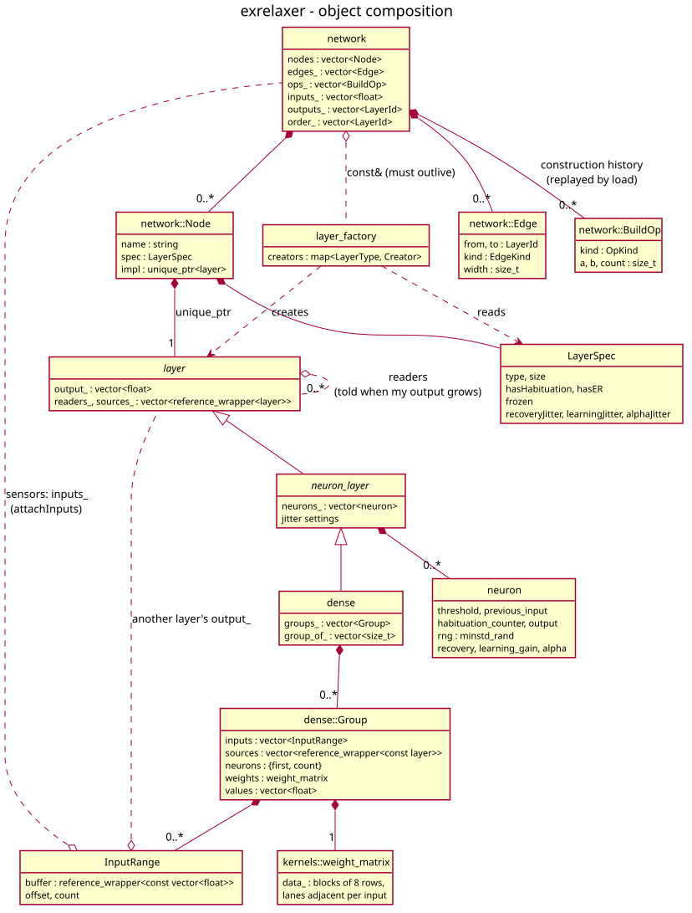
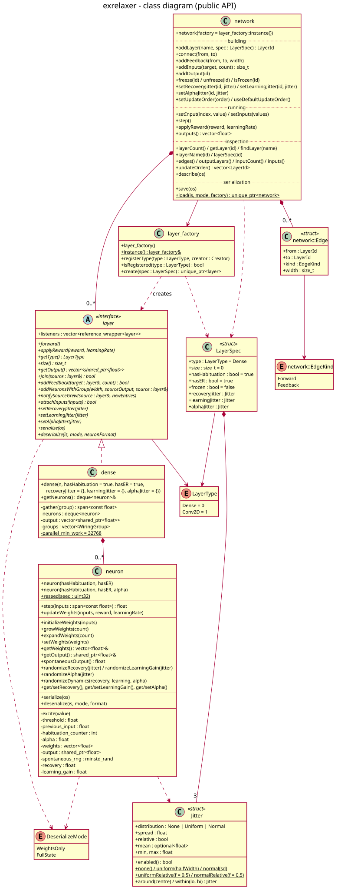

# exrelaxer documentation

Detailed reference for each class. For building, a quick start and the list
of known limitations, see the [project README](../README.md).

| Page | Covers |
|------|--------|
| [neuron](neuron.md) | `neuron`, `DeserializeMode`, `Habituation`, `ThresholdGrowth`, the tunable constants: E-R, habituation, fixed gate and ReLU, learning rule, serialization format |
| [learning](learning.md) | `LearningRule`: the learning rules a layer can use (sign, trace, feedback alignment, perturbation, Oja, BCM), bias, decay, `applyError` |
| [layer](layer.md) | `layer` (base class), `neuron_layer`, `Shape`, `InputRange`, `LayerType`: what every layer type shares |
| [dense](dense.md) | `dense`: wiring groups, growth propagation, SIMD forward pass and learning |
| [spatial](spatial.md) | image layers: `retina` (grid and spiral sampling), `conv2d`, `locally_connected2d`, `pool2d`, `Window2D` |
| [audio](audio.md) | sound layers: `cochlea` (FFT into mel or linear frequency bands), `history` (the last ticks side by side: a spectrogram) |
| [multimodal](multimodal.md) | several senses in one network: named input sources, microphones, `resize2d`, stereo `disparity` |
| [nonlinearity](nonlinearity.md) | experiments on whether E-R dynamics replace network size: static tasks, ReLU / E-R / fixed threshold / clamp, depth × width grid, minimum architectures |
| [activity](activity.md) | experiments on E-R activity without a penalty: sparsity, path choice, fatigue, history; the fixed-threshold control `gate` |
| [kernels](kernels.md) | weight layout, SIMD kernels, determinism, parallelism, performance, random streams |
| [layer_factory](layer_factory.md) | `layer_factory`, `LayerSpec`: creating layers by type, registering new types |
| [network](network.md) | `network`: layer graph, inputs/outputs, update order, freezing, save/load |
| [pattern_benchmark](pattern_benchmark.md) | Task support (`NNtesting/tasks/pattern_benchmark.hpp`): gapped-pattern benchmark, frozen value detectors, delay window |
| [NNtesting](../NNtesting/README.md) | The `nntest` benchmark harness: experiments, parameter sweeps, result files, comparisons |
| [research](research.md) | Research log: parameter changes, mechanisms, topologies, jitter and what each showed |

## How the pieces fit together

```
network ──owns──> layer (via layer_factory, by LayerType)     output buffer, shape
                    └── neuron_layer ──owns──> neuron × N     (threshold, habituation state)
                          └── dense ──owns──> wiring groups  (input ranges, weight matrix)
```

- A **neuron** turns one weighted sum into one output value and keeps its
  own adaptive state (E-R threshold, habituation counter).
- A **layer** owns a contiguous output buffer. `neuron_layer` adds neurons;
  `dense` adds the wiring that decides which values each neuron reads, and
  owns the weights, laid out for SIMD ([kernels](kernels.md)). `dense` is
  the fully connected type; the [spatial](spatial.md) types handle images.
- A **network** owns layers, records how they are connected, owns the input
  sensors, decides the order in which layers run, and saves/loads everything.
- **layer_factory** lets the network create layers from a `LayerSpec`
  without knowing their concrete class.

### Composition

What owns what (filled diamond: owns; open diamond / dashed: refers to).
Readers refer to a source's output buffer by range; they never own it.



### Class diagram



### Interactions

| Diagram | Shows | Details in |
|---------|-------|------------|
| [One tick](diagrams/sequence_step.svg) | `setInputs` → `step` → `outputs` → `applyReward` | [network](network.md#running), [dense](dense.md#forward) |
| [Feedback growth](diagrams/sequence_growth.svg) | how `addFeedback` adds neurons and extends every reader | [dense](dense.md#growth-propagation) |
| [Save and load](diagrams/sequence_save_load.svg) | recording and replaying the construction history | [network](network.md#serialization) |

### Diagram sources

The diagrams are PlantUML sources in [diagrams/](diagrams/) (`*.puml`),
rendered to SVG. After editing a source, regenerate with:

```bash
cd doc/diagrams && plantuml -tsvg *.puml
```

## Core concepts

### Values are read in place

Each layer's outputs live in one contiguous buffer. A layer that reads
another holds `InputRange`s into that buffer (the buffer object, an offset
and a count), so it always reads the current values without being notified,
and a whole range is copied with one `memcpy`. Input sensors are a buffer
too, owned by the network (or by the caller when using layers directly).

### A tick and its timing

One tick is one call to `forward()` on each layer, in some order (in a
network: one `network::step()`). A layer reads whatever values its sources
hold **at the moment its own `forward()` runs**:

- a source that already ran this tick delivers this tick's value;
- a source that runs later delivers last tick's value.

So the update order *is* the timing model. `network` defaults to the
topological order of its forward edges (a value crosses the whole forward
path in one tick; feedback arrives one tick late), and `setUpdateOrder`
lets you build delay lines by running a chain of copy layers oldest-first.

### Wiring groups

Inside a `dense` layer, neurons are organised in **wiring groups**: a set of
neurons plus one input pool they all read. `join` creates a group of all
current neurons (or appends the source to their group); `addFeedback` adds
new neurons in a group of their own; `attachInputs` connects external
sensors. Every neuron is in at most one group. When a source layer grows, every
group reading it grows too, and its neurons get matching new weights. See
[dense](dense.md#wiring-groups).

### Learning

Learning is local. With the default sign rule it is reward-modulated:
`applyReward(reward, learningRate)` moves each *eligible* neuron's weights by
`learningRate × gain × reward × eligibility × sign(input)`, and every eligible
neuron receives the same reward. There is no backpropagation; the other
[learning rules](learning.md), chosen per layer, include feedback alignment,
which gives hidden neurons their own error signal through `applyError`. See
[neuron](neuron.md#learning) for eligibility and the exact
rule, and [pattern_benchmark](pattern_benchmark.md#reward-modes) for why an
error-driven reward (reward only when wrong) matters in practice.

### Reproducibility

Initial weights and each neuron's spontaneous-firing generator come from
process-wide random streams. Call `exr::reseed(seed)` before building a
network to make it independent of anything created earlier in the process.
Results never depend on the number of threads or the SIMD width
([kernels](kernels.md#determinism)).
