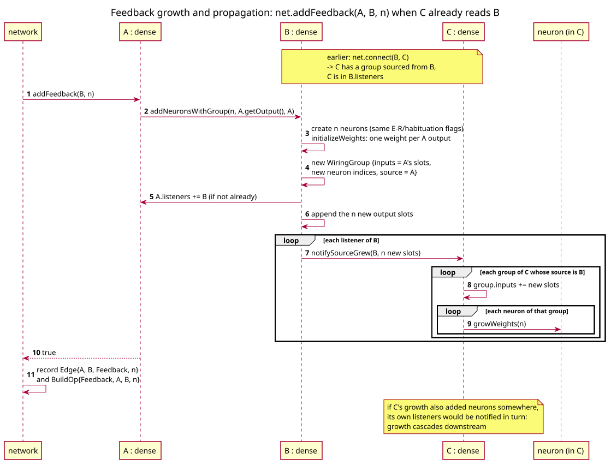
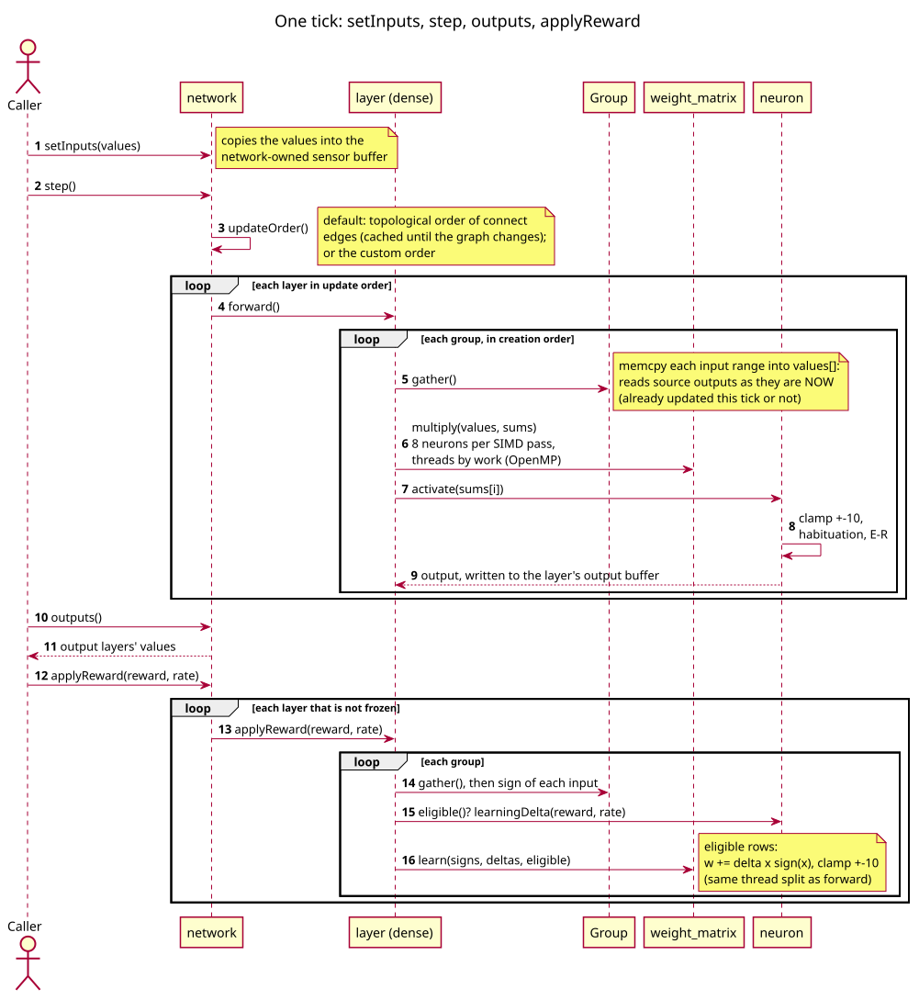

# dense

`core/layers/dense.hpp`, `core/layers/dense.cpp`

The standard layer: a growable set of [neurons](neuron.md), each reading a
whole input pool (fully connected within its group). Implements
[layer](layer.md).

```cpp
explicit dense(size_t nNumber, bool hasHabituation = true, bool hasER = true,
               const Jitter& recoveryJitter = {}, const Jitter& learningJitter = {},
               const Jitter& alphaJitter = {});
```

Creates `nNumber` neurons with the given mechanisms, with no weights and no
wiring yet. Every neuron the layer adds later (feedback growth) gets the same
`hasHabituation` / `hasER` flags. With jitter enabled, every neuron it
creates, now or through growth, gets its recovery, learning gain and alpha
drawn from it ([per-neuron dynamics](neuron.md#per-neuron-dynamics)).
`setRecoveryJitter(j)` / `setLearningJitter(j)` / `setAlphaJitter(j)` redraw that one parameter
for every existing neuron, in neuron order, and keep `j` for later growth;
`getRecoveryJitter()` / `getLearningJitter()` / `getAlphaJitter()` return the settings. A layer may start with 0 neurons and grow
only through feedback.

## Wiring groups

A `dense` layer organises its neurons in **wiring groups**. A group is:

- an **input pool**: pointers to the values it reads (a source layer's
  outputs, or external sensors), plus
- the **neurons** that read that pool; each of them has one weight per pool
  entry, in pool order,
- the **source** layer the pool comes from, used for growth propagation.

Each call below creates or extends a group:

| Call | Effect |
|------|--------|
| `B.join(A)` | new group in `B`: **all neurons B has now**, reading all of `A`'s outputs. Neurons get fresh random weights. `B` becomes a listener of `A`. |
| `A.addFeedback(C, n)` | new group in `C`: **n new neurons**, reading all of `A`'s outputs. `C`'s existing neurons are untouched. `C` becomes a listener of `A`, and `C`'s own listeners are told that `C` grew. |
| `A.attachInputs(sensors)` | if `A` has no group yet: new group of all neurons reading the sensors. Otherwise the sensors are **appended to A's first group** and its neurons get extra weights. |

### Growth propagation

When a layer grows (through `addFeedback` into it), it notifies every
listener with the new output pointers. Each listener finds every group whose
source is the grown layer, appends the new pointers to the pool and appends
matching random weights to each neuron in the group (`growWeights`). This
cascades naturally: if the grown layer's growth adds neurons elsewhere, those
layers notify their listeners in turn.

```
B.join(A); C.join(B);
X.addFeedback(B, 3);   // B: +3 neurons -> C's group reading B gets 3 more inputs,
                       // and every neuron in that group 3 more weights
```



### Caveats

- **Call `join` early.** A group created by `join` contains only the neurons
  present at that moment. Neurons added later (by feedback) are not in it.
- **Join each source once.** Joining the same pair twice creates two groups.
- **A neuron should belong to one group.** If a layer joins two different
  sources, every existing neuron is in both groups: it is stepped once per
  group per tick and only the last group's result survives. To read several
  sources, give each its own neurons with `addFeedback`, or concatenate the
  sources into one layer first (`addDelayWindow` in the pattern benchmark
  does this).
- **Self-feedback.** A group whose source is the layer itself (`A.join(A)`
  or `A.addFeedback(A, n)`) reads a copy taken just before the group runs,
  so all its neurons see the same values regardless of order.

## forward()

For each group, in creation order:

1. **Gather**: copy the group's input values into a contiguous `float`
   buffer. The neurons' dot products then read memory sequentially instead of
   chasing one pointer per input, which also lets the compiler vectorize.
2. **Step** every neuron of the group against that buffer.



Because inputs are copied first, a neuron in a group sees the values from
before the group ran. Groups run one after another, so a later group of the
same layer sees the updated outputs of earlier groups.

### Parallelism

With OpenMP, a group's neurons are stepped in parallel with
`neurons × inputs / parallel_work_per_thread` threads (16384 multiply-adds
per thread), capped at the OpenMP maximum; groups that would get fewer than
two threads run serially. Results are identical to the serial run.

The thread count scales with the work because waking every thread for a
mid-sized group is fast but wasteful. Measured on 20 threads, for a
reservoir workload whose largest group is 200 × 300:

| Policy | Wall time | CPU time |
|--------|-----------|----------|
| serial | 2.40 s | 2.39 s |
| 16384 per thread (3 threads) | 1.22 s | 2.86 s |
| every thread once ≥ 32768 (old) | 0.91 s | 6.32 s |

Large groups (≥ 16384 × 20 multiply-adds) still use every thread: a
1000 × 1000 group steps in about 70 µs instead of 890 µs serially. To limit
threads further, set `OMP_NUM_THREADS`.

## applyReward()

For each group: gather its current input values, then call
`updateWeights(values, reward, learningRate)` on each of its neurons (see
[neuron](neuron.md#learning-updateweights)). Call it right after `forward()`
so the inputs are the ones the neurons stepped on. It is not parallelized.

## Access

| Method | Purpose |
|--------|---------|
| `getNeurons()` | the `std::deque<neuron>`; a deque so growth never invalidates references to existing neurons |
| `getOutput()` | one live output pointer per neuron, in neuron order |
| `size()` | number of neurons |
| `getType()` | `LayerType::Dense` |

Hand-wiring (fixed weights for detectors, copy layers, etc.) is done through
`getNeurons()[i].setWeights(...)`; weights are in the order of the neuron's
group pool.

## Serialization

`serialize` writes `hasHabituation`, `hasER`, the neuron count (`size_t`),
then each neuron ([format](neuron.md#serialization)). The wiring is **not**
saved.

`deserialize`:

- if the layer already has the same number of neurons, each neuron is
  restored in place: output pointers held elsewhere stay valid. This is the
  intended use: rebuild the same topology, then deserialize;
- otherwise the neurons are **replaced**, which creates new output slots and
  leaves the groups pointing at old indices. Only do this on an unwired
  layer.

To save wiring as well, use [network::save](network.md#serialization).
