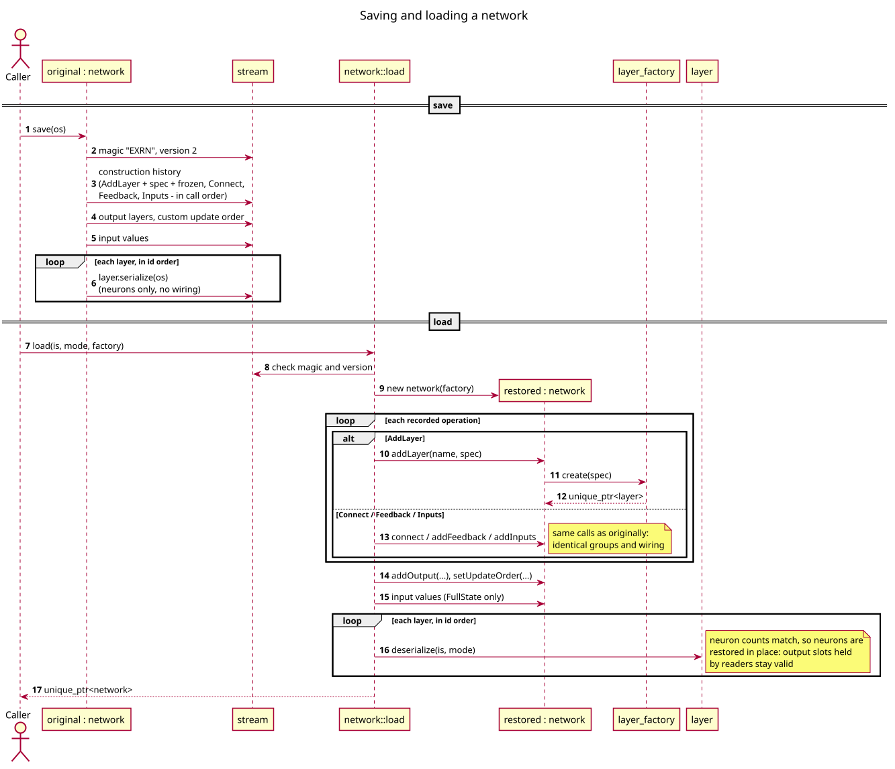

# network

`core/network.hpp`, `core/network.cpp`

A graph of [layers](layer.md) plus the input sensors that feed it and the
layers read as its output. It creates layers through a
[layer_factory](layer_factory.md), records every connection, decides the
order in which layers run, and saves/loads the whole thing including the
wiring.

```cpp
#include "network.hpp"

network net;
auto in  = net.addLayer("in",  {LayerType::Dense, 16});
auto hid = net.addLayer("hid", {LayerType::Dense, 32});
auto out = net.addLayer("out", {LayerType::Dense, 4, true, false});

net.addInputs(in, 2);            // two sensors feeding "in"
net.connect(in, hid);            // hid reads in
net.connect(hid, out);
net.addFeedback(out, hid, 8);    // 8 new neurons in hid read out
net.addOutput(out);

net.setInputs({0.5f, -0.2f});
net.step();
std::vector<float> y = net.outputs();
net.applyReward(1.0f, 0.005f);
```

## Construction and lifetime

```cpp
explicit network(const layer_factory& factory = layer_factory::instance());
```

The factory is held by reference and must outlive the network. A network is
**neither copyable nor movable**: layers hold references to each other and
the network hands out references to its layers. Use
`std::unique_ptr<network>` to pass one around (`load` returns one).

## Building

| Method | Effect |
|--------|--------|
| `LayerId addLayer(const std::string& name, const LayerSpec& spec)` | create a layer through the factory. Names must be unique and non-empty. Ids are consecutive from 0. |
| `void connect(LayerId from, LayerId to, WeightInit init = Random)` | `to` reads `from`'s output (`to.join(from)`): a **forward edge**. Every neuron `to` has now reads `from`, in addition to what it already reads (one weighted sum over all its sources); neurons added later by feedback are not wired. Each pair once. `connect(x, x)` makes every neuron of x read x (recurrence). `WeightInit::Zero`: the new weights start at 0, so the connection changes nothing until it learns. |
| `void addFeedback(LayerId from, LayerId to, size_t width)` | add `width` new neurons to `to`, reading `from`: a **feedback edge**. Layers already reading `to` are extended automatically. |
| `size_t addInputs(LayerId target, size_t count, const std::string& name = "")` | create `count` sensors (owned by the network, initially 0) and attach them to `target`. Returns the index of the first new sensor. With a `name` they are a [named input source](#input-sources). |
| `size_t addInputs(LayerId target, const Shape& image, const std::string& name = "")` | the same for an image (`image.size()` sensors, channel after channel, row after row), e.g. for a [retina](spatial.md#retina); the source keeps the shape |
| `void connectInputs(const std::string& name, LayerId target)` | the named source's sensors also feed `target` (one camera read by several layers) |
| `void addOutput(LayerId id)` | mark a layer as output. `outputs()` concatenates output layers in marking order. |

The wiring semantics are those of `dense`; read
[dense: wiring groups](dense.md#wiring-groups). A layer connected from
several sources, or from a source and sensors, integrates them all in one
weighted sum per neuron.

Errors: unknown id → `std::out_of_range`; duplicate or empty name, zero
inputs, a non-default `learningRule`, `gate`, `rectify`, `habituationRule`,
`thresholdGrowth`, `spontaneous`, `restingThreshold` or `normalize` on a layer without neurons
(or `normalize` on one with fixed filters) (or a gate / `rectify` with
E-R) → `std::invalid_argument`; connecting a pair twice →
`std::logic_error`; a layer type that does not support the operation →
`std::logic_error`.

## Input sources

Each `addInputs` call creates one block of sensors, an `InputSource`: its
name (`""` if unnamed), the index of its first sensor, its shape
(`Shape::flat(count)` unless created from a shape) and the layers it feeds.
A network with several senses names them and sets each on its own:

```cpp
net.addInputs(leftRetina, Shape{1, 48, 64}, "left_eye");
net.addInputs(rightRetina, Shape{1, 48, 64}, "right_eye");
net.addInputs(ears, 2 * earSpec.hop, "microphones");   // a cochlea with 2 channels
net.connectInputs("left_eye", peripheral);            // the same sensors, read by one more layer

net.setInputs("left_eye", leftImage);
net.setInputs("right_eye", rightImage);
net.setInputs("microphones", sound);
net.step();
```

Names are unique; an unknown name throws `std::out_of_range`, a wrong value
count `std::invalid_argument`. `setInputs(values)` still sets every sensor
at once, sources in creation order. See [multimodal](multimodal.md).

## Running

| Method | Effect |
|--------|--------|
| `setInput(i, v)` | set sensor `i` |
| `setInputs(values)` | set all sensors; the count must equal `inputCount()` (span or `{...}` list) |
| `setInputs(name, values)` | set one named source's sensors; the count must equal its size |
| `step()` | call `forward()` on every layer once, in [update order](#update-order) |
| `applyReward(reward, learningRate)` | call `applyReward` on every layer that is **not frozen** |
| `applyError(errors, learningRate)` | one error per output: each unfrozen layer learns by its [learning rule](learning.md#driving-learning) |
| `setLearningRule(id, rule)` | change a layer's [learning rule](learning.md) (also `LayerSpec::learningRule`) |
| `outputs()` | current values of all output layers, concatenated |

A typical tick: set inputs → `step()` → read `outputs()` → `applyReward(...)`.


## Update order

`step()` runs layers in an order that defines the timing: a layer reads its
sources' values as they are when it runs. The full table of which value a
neuron reads at *t* (and what learning reads) is in
[model](model.md#which-value-a-neuron-reads).

**Default:** topological order of the forward (`connect`) edges; among
layers that are ready at the same time, the one created first runs first.
Consequences:

- a value crosses the whole forward path within one tick;
- a feedback edge from a later layer to an earlier one delivers the
  previous tick's value;
- feedback edges and self-connections do not constrain the order;
- a cycle of forward edges makes `step()` / `updateOrder()` throw
  `std::logic_error`.

**Custom:** `setUpdateOrder(order)` must list every layer exactly once.
Adding a layer afterwards makes `step()` throw until the order is set again;
`useDefaultUpdateOrder()` returns to the default. A custom order is how
delay lines are built: run a chain of copy layers oldest-first, so each copy
takes its predecessor's value before the predecessor updates:

```cpp
// tap2 reads tap1, tap1 reads src: after the step, tap1 = src(t-1), tap2 = src(t-2)
net.setUpdateOrder({tap2, tap1, src, /* readers of the taps */ ...});
```

`updateOrder()` returns the order in use.

## Freezing

```cpp
void freeze(LayerId id);
void unfreeze(LayerId id);
bool isFrozen(LayerId id) const;
```

A frozen layer still runs `forward()` normally but `applyReward()` skips it.
Layers can also start frozen through `LayerSpec::frozen`. Typical uses:
hand-wired detectors, copy/delay layers, fixed random feature layers.

Freezing is per layer. A feedback edge adds its neurons *into* the target
layer, so they cannot be frozen separately from that layer's other neurons;
to freeze a feedback path on its own, route it into a dedicated layer.
Calling `applyReward` on a layer object directly bypasses freezing.

### Freezing parts of a layer

```cpp
void freezeNeurons(LayerId id, size_t first, size_t count, bool frozen = true);
void freezeInputs(LayerId id, LayerId source, bool frozen = true);            // Dense
void freezeInputs(LayerId id, const std::string& inputSource, bool frozen = true);
```

A frozen neuron runs but its weights and bias stay, whatever the learning
rule (`neuron_layer::setNeuronsFrozen`). Frozen inputs are weight columns: a
Dense layer stops learning the weights with which it reads `source`, in
every wiring group (`dense::setInputsFrozen`); inputs added later learn. A
readout that keeps what it learned from old layers while it learns to read
a new one freezes its inputs from the old layers. Both are saved with the
layer.

## Buses

```cpp
LayerId addBus(const std::string& name, LayerSpec spec, bool frozen = true);
void writeBus(LayerId writer, LayerId bus, WeightInit init = Random);   // connect(writer, bus)
void subscribe(LayerId reader, LayerId bus, WeightInit init = Random);  // connect(bus, reader)
bool isBus(LayerId id) const;
std::vector<LayerId> buses() const, busWriters(LayerId bus) const, busReaders(LayerId bus) const;
```

A bus is a named group of neurons that some layers write into and any
number of later layers read from. Growing a network then means subscribing
a new layer to the buses it needs, without rewiring anything else. A bus is
a Dense layer (`LayerSpec::bus` set) and has its **own neuron type**,
whatever the layers around it use: E-R without habituation
(`LayerSpec::Dense(n, false, true)`), linear, ReLU, or classic perceptrons
(`LayerSpec::Perceptron(n, threshold)`: output 1 when the weighted sum
exceeds the threshold, else 0). Buses start frozen (the weights from the
writers do not learn); `unfreeze(bus)` lets them learn. Sensors can write
into a bus too (`connectInputs`), e.g. a fixed vision bus that every new
column reads:

```cpp
const auto vision = net.addBus("vision", LayerSpec::Dense(28, false, true));
net.connectInputs("eye", vision);
const auto column = net.addLayer("c3", LayerSpec::Dense(32, true, true));
net.subscribe(column, vision);
net.connect(column, readout, WeightInit::Zero);   // joins the readout without changing it
net.freezeInputs(readout, old_column);            // the readout keeps what it learned
```

`describe()` lists each bus with its writers and readers.

## Changing a running network

```cpp
void growLayer(LayerId id, size_t count, WeightInit outgoing = Zero, bool freezeExisting = false,
               size_t group = 0);
void pruneNeurons(LayerId id, std::vector<size_t> indices);
```

Between two steps the network can grow and shrink; everything else keeps
its state, and `save` records the change, so a loaded network has the same
structure.

- **Width** (`growLayer`, Dense): `count` new neurons reading the same
  inputs as the layer's wiring group `group` (0: the neurons it was built
  with; a group reading the layer itself makes the new neurons read their
  own outputs too). Their incoming weights are drawn as usual. Every layer
  reading the grown one gets the new outputs with `outgoing` weights:
  `Zero` (the default) means the network behaves exactly as before until
  the new weights learn. `freezeExisting` freezes the layer's old neurons,
  so only the new ones learn.
- **Depth**: `addLayer` and `connect` work on a running network; a new
  layer joins its readers with `connect(new, reader, WeightInit::Zero)`.
- **Pruning** (`pruneNeurons`, Dense): the neurons' weights, state and
  outputs go, and every layer reading the layer drops the matching inputs
  (those readers must be Dense; anything else throws `std::logic_error`
  before changing anything). Indices may come in any order.
- **Learning rules** change with `setLearningRule`, freezing with
  `freeze`, `freezeNeurons` and `freezeInputs`, and the
  [critic and curiosity model](learning.md#actor-critic-and-curiosity) can
  be set, replaced or removed at any time; they follow growth and pruning of
  the layers they read.

## Per-neuron dynamics

```cpp
void setRecoveryJitter(LayerId id, const Jitter& jitter);
void setLearningJitter(LayerId id, const Jitter& jitter);
void setAlphaJitter(LayerId id, const Jitter& jitter);
```

These apply to layers made of neurons ([neuron_layer](layer.md#neuron_layer));
other layer types throw `std::invalid_argument`.

Each neuron has its own E-R recovery, learning gain and E-R alpha (see
[neuron](neuron.md#per-neuron-dynamics)). Whether and how each is
randomized is normally decided **at layer creation**, through
`LayerSpec::recoveryJitter`, `learningJitter` and `alphaJitter`; each is
optional and off by default. These methods change a setting later: the parameter is **redrawn for every existing neuron
of the layer** from the new `Jitter` (a disabled jitter resets it to the
default), and neurons added later use the same jitter. The three
parameters are independent; a layer can have any combination.

```cpp
net.setRecoveryJitter(res, Jitter::normal(0.02f).around(0.95f).within(0.9f, 0.99f));
net.setLearningJitter(hid, Jitter::uniform(0.1f));
net.setLearningJitter(out, Jitter::uniformRelative());   // gain ±50%, e.g. 2 -> 1..3

// or at creation:
net.addLayer("res", {LayerType::Dense, 100, false, true, true,
                     Jitter::uniformRelative(),    // recovery
                     {},                           // learning gain: none
                     Jitter::uniformRelative()});  // alpha ±50%
net.setRecoveryJitter(res, Jitter::none());   // back to recovery_factor for every neuron
net.setRecoveryJitter(res, Jitter::none().around(0.9f));  // exactly 0.9 for every neuron
```

The current settings are in `layerSpec(id)`, shown by `describe()` and saved
with the network.

## Inspection

| Method | Returns |
|--------|---------|
| `layerCount()` | number of layers |
| `getLayer(id)` | the `layer&` |
| `layerAs<T>(id)` | the layer as its concrete type, e.g. `layerAs<dense>(id).setWeights(...)` or `layerAs<conv2d>(id)`; throws `std::bad_cast` for another type |
| `findLayer(name)` | id; throws `std::out_of_range` if absent |
| `layerName(id)`, `layerSpec(id)` | name, spec (with the current frozen flag) |
| `edges()` | every connection in creation order: `{from, to, kind, width}`, kind `Forward` or `Feedback` |
| `outputLayers()` | output layer ids in marking order |
| `inputCount()`, `inputs()` | number of sensors, their current values (one contiguous buffer, in `addInputs` order) |
| `inputSources()`, `inputSource(name)`, `inputs(name)` | every `addInputs` block (`name`, `first`, `shape`, `targets`), one by name, a named source's values |
| `updateOrder()` | the order `step()` uses |
| `describe(os)` | human-readable dump: layers (output count, shape of spatial layers, habituation, E-R, or without E-R the gate (`=g`) or ReLU (`relu`, `>g` with a gate), learning or frozen, recovery / learning-gain / alpha distributions and learning rule of layers with neurons), each input source (name, size, shape, the layers it feeds), edges, outputs, update order. The habituation and threshold growth rules are not shown |

Example `describe` output:

```
  layers (3):
    id  name   outputs  shape         hab   E-R   learns  recovery                        learning gain  alpha       rule
    0   in     16       -             on    on    yes     0.95 N(sd 0.02) in [0.9, 0.99]  2              1.2 U+-50%  sign
    1   hid    40       -             on    on    yes     0.9                             2 U+-0.1       1.2         sign
    2   out    4        -             on    -     yes     0.9 U+-50% of 1-r               2 U+-50%       1.2         sign
  inputs: 2 -> in
  edges:
    in -> hid
    hid -> out
    out -> hid  (feedback, 8 new neurons)
  outputs: out
  update order: in hid out
```

## Serialization

```cpp
void save(std::ostream& os) const;
static std::unique_ptr<network> load(std::istream& is,
                                     DeserializeMode mode = DeserializeMode::FullState,
                                     const layer_factory& factory = layer_factory::instance());
```

The network records every successful `addLayer`, `connect`, `addFeedback`,
`addInputs`, `connectInputs`, `growLayer` and `pruneNeurons` call. `save` writes that history, then the rest of the
state; `load` **replays the history** on a new network, which reproduces the
exact wiring (groups, feedback neurons, sensor attachment), then restores each
layer's state in place.

- `FullState`: everything, including input values and each neuron's random
  generator. The loaded network continues bit-identically to the original.
- `WeightsOnly`: weights, frozen flags, jitter settings and per-neuron
  dynamics; thresholds, habituation state, outputs and inputs are reset.

**Files from older format versions** (1–5) load as weights only, whatever
mode is requested: topology, frozen flags (from version 2) and weights. Input
values and neuron state are reset, and jitter settings and per-neuron
recovery / learning gain come back as defaults.



Loading does not depend on the global random state. It throws
`std::runtime_error` for data that is not a network, an unsupported version,
truncation or implausible counts; errors in the replayed topology surface as
the building methods' exceptions.

### File format

Binary, native endianness (not portable across platforms). Counts and ids
are `uint64`.

1. Magic `EXRN`, format version `uint32` (currently **18**).
2. Operation count, then each operation: kind (`uint8`) and fields:
   - AddLayer: name length + bytes, `LayerType` (`uint8`), size,
     hasHabituation, hasER, frozen (`uint8` each; frozen is the state at save
     time), then recoveryJitter, learningJitter and alphaJitter, each as distribution
     (`uint8`), spread (`float`), relative (`uint8`), has-mean (`uint8`),
     mean, min, max (`float`); then the spatial parameters: window
     (kernel height and width, strides, paddings), pooling mode (`uint8`),
     retina image shape (channels, height, width), sampling (`uint8`),
     spacing and radius (`float`); then the audio parameters: cochlea sample
     rate (`float`), hop, window, bands, min and max frequency (`float`),
     frequency scale and compression (`uint8`), gain (`float`); then the
     learning rule: type and bias (`uint8`), decay, trace, baseline, noise,
     bcmRate (`float`), winners (`uint32`); then (version 10) cochlea
     channels, resize height and width, interpolation (`uint8`), min and
     max disparity (`int32`), disparity window, measure (`uint8`); then
     (version 11) gate (`float`); (version 12) rectify (`uint8`); (version 13) habituation
     steps (`uint32`), tolerance, decay (`float`); (version 14) threshold growth
     rule (`uint8`), amount (`float`); (version 15) habituation fadeAfter
     (`uint32`), spontaneous below, amplitude, rate (`float`); (version 16)
     normalize (`uint8`); (version 17) resting threshold (`float`);
     (version 18) binary, bus (`uint8`). Version 18 rules also carry
     width (`float`) and window (`uint32`) in the layer data.
   - Connect: from, to; (version 18) weight init (`uint8`)
   - Feedback: from, to, width
   - Inputs: target, count; then (version 10) name length + name, shape
     channels, height, width
   - ConnectInputs (version 10): source index, target
   - Grow (version 18): layer, wiring group, count, outgoing weight init (`uint8`)
   - Prune (version 18): layer, index count, indices
3. Output count + ids; custom-order flag (`uint8`), and if set, count + ids.
4. Input count + values (`float`).
5. Each layer's `serialize()` output, in id order. Layers of neurons end
   theirs with the learning rule and its state (neuron format 3, see
   [learning](learning.md#serialization)); from version 18 (neuron format
   4) also the per-synapse rules' state, frozen neurons and, for Dense,
   frozen inputs.
6. (version 18) Critic flag (`uint8`) and, if set, its spec and weights,
   traces and last state; the same for the curiosity model.

| Version | Added |
|---------|-------|
| 1 | construction history, outputs, order, inputs, layer data |
| 2 | frozen flag per layer |
| 3 | uniform jitter widths per layer; per-neuron recovery and learning gain in the layer data (neuron format 2) |
| 4 | jitter as a full distribution |
| 5 | relative-spread flag per jitter |
| 6 | alpha jitter per layer |
| 7 | spatial parameters per layer (window, pooling mode, retina) |
| 8 | audio parameters per layer (cochlea) |
| 9 | learning rule per layer; layers of neurons append the rule's state (neuron format 3) |
| 10 | cochlea channels, resize and disparity parameters per layer; input source names and shapes; `connectInputs` |
| 11 | fixed firing threshold (`gate`) per layer |
| 12 | rectification (`rectify`, ReLU) per layer |
| 13 | habituation rule (steps, tolerance, decay) per layer |
| 14 | E-R threshold growth rule (rule, amount) per layer; older files load with the `Log` rule |
| 15 | habituation fadeAfter and spontaneous firing (below, amplitude, rate) per layer; older files load with `fadeAfter = steps` in fade mode and the original spontaneous firing |
| 16 | normalised weighted sum (`normalize`) per layer; older files load without it |
| 17 | E-R resting threshold per layer; older files load with 0.2 |
| 18 | binary output and bus flag per layer; weight init per connect; growth and pruning; neuron format 4 (Eligibility, EProp, Surrogate state; frozen neurons and inputs); critic and curiosity model |
| 19 | minimum size and the grown-layer tag per layer |
| 20 | no new data: the default recovery became 0.5; older files keep 0.9 for the neurons they grow or reset (their recovery jitter is centred on 0.9) |

Versions 1–5 load as weights only (see above); unknown versions are
rejected.

## Threading

A network is not thread-safe; use one thread per network. Inside `step()`,
large `dense` groups run in parallel (see [dense](dense.md#parallelism)).
