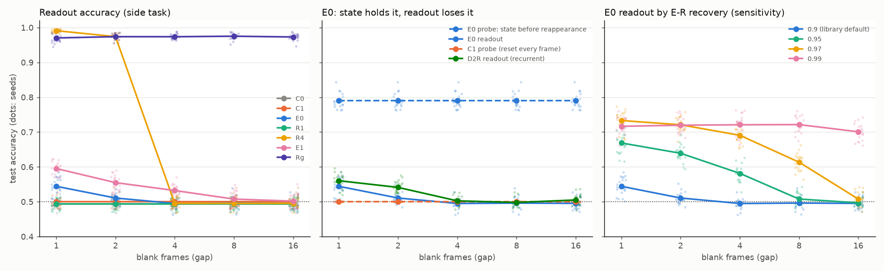

# Video temporal memory

Can a feed-forward E-R layer keep temporal information from a video stream
in its neurons' own state, with no recurrence and no explicit frame history?
And how much explicit history is that state worth? Research log
[§21](research.md#21-video-temporal-memory); code and options in
[NNtesting/experiments/video_memory](../NNtesting/experiments/video_memory/README.md);
raw results in [results/video-memory](../results/video-memory/).

## Task

A small square moves left or right on a 20 × 15 grayscale screen for 3–6
frames. Then the screen goes blank (input exactly zero) for `gap` frames
while the network keeps ticking. Then the object reappears and stands
still for two frames, the readout interval. The answer, LEFT or RIGHT,
exists only in the frames before the blank.

```
visible motion -> gap blank frames (0, 1, ... 16) -> reappearance (2 frames, 8 ticks: read out here)
```

Size (2–3 px), brightness (0.5–1), row, speed (1–2 px per frame), visible
duration, and background noise (sd 0–0.05) are drawn per clip,
independently of the label. Classes are balanced. Train (1000),
validation (500) and test (1000) clips come from different seeds. One seed
gives the same clips at every gap and for every model, so every comparison
is paired.

- **side** (the primary task): the object moves towards the centre and
  vanishes 1–4 px short of it, then reappears at the centre. A right-mover
  is last seen left of centre, so remembering where the object was is
  enough.
- **order**: motion wraps around the screen and starts anywhere, and the
  reappearance column is random. Every single frame has the same
  distribution for both classes, so only the order of two frames gives the
  direction.

**Audit** (`audit.py`, 20,000 training and 20,000 test clips; the 99%
chance band is ±0.009):

| Classifier sees | side: pixels | side: 2048 random ReLU | order: pixels | order: 2048 random ReLU |
|---|---|---|---|---|
| final frame | 0.501 | 0.502 | 0.502 | 0.505 |
| both readout frames | 0.501 | 0.499 | 0.502 | 0.503 |
| last visible frame | 1.000 | 1.000 | 0.503 | 0.502 |
| last two visible frames | 1.000 | 1.000 | 0.515 | 0.992 |

Per class, the final frames' total intensity, maximum pixel, column
centroid and bright-pixel count agree to within 0.5%. The side task's
reappearance frames are generated without the label, so their
distribution is identical for both classes by construction. On the order
task, only a wide nonlinear layer reads direction from two frames.

## Networks

Input → 128 hidden neurons (frozen after a random initialization) → 2
readouts. Each frame is held for 4 ticks. The larger mean readout output
over the 8 readout ticks wins.

| | Hidden | Shown each frame |
|---|---|---|
| C0 | ReLU | current frame |
| C1 | E-R, reset to rest at every frame; E0's weights and inputs (the memory-reset ablation) | current frame |
| E0 | E-R | current frame |
| R1 | ReLU | current + previous frame |
| R4 | ReLU | current + previous 3 frames |
| E1 | E-R | current + previous frame |
| Rg | ReLU | the shortest window that still shows the last visible frame at the reappearance: gap + 1 previous frames (order: gap + 2) |
| D2 | E-R → E-R | current frame |
| D2R | E-R → E-R, the second layer also reads its own previous output | current frame |

**Settings, one set for every gap:** normalised sum x·w/|w| in the hidden
layers, no habituation, linear threshold growth, recovery 0.9, resting
threshold 0.2, weight and output clamps 10. These are the library defaults.
The learning gain does not apply, because nothing in the hidden layer
learns. The readouts are the repository's plain readout neurons: raw
weighted sum plus bias, clamped. Their weights come from ridge regression
of ±1 targets on the mean hidden output over the readout ticks, with the
penalty chosen on validation. The hidden layer is frozen and feed-forward,
so its activity is recorded once per clip. The library's online error
rule (`lms_lr`) reaches 0.97 on R4 but does not find E0's weak signal
(0.50), which is why the readouts use ridge regression.

C1 and the reset ablation are one model. "E-R without state" and "E0 with
all state reset at every frame", with the same weights and inputs, are the
same construction.

## Results (side task, 20 seeds)



Test accuracy, mean ± sd over seeds. The horizon is the largest gap at
which the one-sided 99% lower confidence bound of the mean over seeds is
above 0.5. Per-seed values are in `results/video-memory/summary.md`.

| | gap 1 | gap 2 | gap 4 | gap 8 | gap 16 | horizon |
|---|---|---|---|---|---|---|
| C0 ReLU | 0.493 ± 0.013 | 0.493 | 0.493 | 0.493 | 0.493 | 0 |
| C1 E-R reset every frame | 0.501 ± 0.017 | 0.501 | 0.501 | 0.501 | 0.501 | 0 |
| **E0 E-R** | **0.544 ± 0.025** | **0.511 ± 0.016** | 0.495 ± 0.014 | 0.496 | 0.495 | **2** |
| R1 ReLU + 1 frame | 0.493 ± 0.015 | 0.493 | 0.493 | 0.493 | 0.493 | 0 |
| R4 ReLU + 3 frames | 0.991 ± 0.005 | 0.974 ± 0.009 | 0.495 | 0.495 | 0.495 | 2 |
| E1 E-R + 1 frame | 0.595 ± 0.018 | 0.555 ± 0.021 | 0.532 ± 0.016 | 0.508 ± 0.020 | 0.502 | 4 |
| Rg ReLU + gap + 1 frames | 0.970 ± 0.013 | 0.974 | 0.974 | 0.975 | 0.973 | 16 |
| D2 E-R → E-R | 0.558 ± 0.022 | 0.538 ± 0.020 | 0.504 | 0.499 | 0.498 | 2 |
| D2R, recurrent | 0.560 ± 0.020 | 0.541 ± 0.018 | 0.502 | 0.498 | 0.505 | 2 |

Paired differences, same clips and seeds (lower 99% bound in brackets):
E0 − C1 is +0.044 (+0.026, 19 of 20 seeds) at gap 1 and +0.010 (−0.004)
at gap 2. E1 − R1 is +0.10, +0.06, +0.04 and +0.01 at gaps 1, 2, 4 and 8
(20, 20, 20 and 15 of 20 seeds). D2R − D2 is within ±0.007 at every gap.

**Probe on the hidden state** (a ridge classifier on E-R thresholds and
outputs, with the network unchanged):

| | after the last visible frame | before the reappearance, every gap from 1 to 16 |
|---|---|---|
| C0, C1 | 0.99, 0.89 | 0.50 |
| E0 | 0.83 | **0.79** |
| E1 | 0.82 | 0.77–0.79 |
| D2, D2R | 0.82 | 0.79 |

**Activity** (hidden spikes per frame on test clips, E0 at gap 1 → 16):
35 per visible frame, 0 during the blank, then 44 → 70 per readout frame,
with 40 → 128 of 128 neurons firing on the first reappearance tick. The
median E-R threshold at the reappearance is 0.13, 0.08, 0.035, 0.0066 and
0.00023 at gaps 1, 2, 4, 8 and 16: 0.9 per silent tick, 4 ticks per frame.
The mean over the whole clip is 33 → 13 spikes per frame for E0, against
223 → 74 for C0 and 257 for Rg.

### Why the state holds the answer and the readout loses it

During the blank, an E-R neuron sees a zero sum, never fires, and its
threshold decays by the same factor 0.9 every tick. That factor applies
to every neuron and has no floor above 1e-10, so the pattern of thresholds
is only rescaled. What the neurons saw before the blank stays in the state
at any gap, which is why the probe holds 0.79 from gap 1 to gap 16. Only
input can read it out: at the reappearance, a neuron fires if its sum
exceeds its threshold, and that one tick is where the history acts. After
a few blank frames every threshold is far below the sums, so nearly every
driven neuron fires whatever it saw before (128 of 128 at gap 16), and
firing resets the threshold to at least 0.4, erasing the trace. The
readable horizon is therefore set by how far the thresholds decay relative
to the sums, not by how long the information survives.

**Recovery sensitivity** (E0, 20 seeds; a separate study, since the sweep
itself uses one setting):

| recovery | gap 1 | gap 2 | gap 4 | gap 8 | gap 16 | horizon | spikes/frame (gap 1) | probe |
|---|---|---|---|---|---|---|---|---|
| 0.9 (default) | 0.544 | 0.511 | 0.495 | 0.496 | 0.495 | 2 | 33 | 0.79 |
| 0.95 | 0.669 | 0.639 | 0.581 | 0.508 | 0.497 | 4 | 20 | 0.86 |
| 0.97 | 0.733 | 0.721 | 0.691 | 0.614 | 0.508 | 8 | 14 | 0.91 |
| 0.99 | 0.716 | 0.720 | 0.721 | 0.721 | 0.701 | 16 | 8 | 0.92 |

A slower recovery moves the horizon out roughly in proportion to the time
constant, raises the accuracy, and cuts activity. At 0.99, E0 holds 0.70
across 16 blank frames (64 ticks) at 4–8 spikes per frame.

## Order task (20 seeds)

Every model is at chance (0.49–0.51 at every gap). The exception is Rg,
at 0.512–0.519: significant, but barely above chance. The probes show why.
Even with both frames in its input, a 128-neuron random ReLU layer carries
only 0.60 of the direction (R1, after the last visible frame), and E0's
state carries none (0.50) even before the blank. The audit needs 2048
random features to reach 0.99. With a frozen random 128-neuron layer, this
task measures the representation, not memory.

## Feedback alignment (separate experiment, 10 seeds)

The hidden layer and readouts first learned online by feedback alignment
from the error on every readout tick (`hidden_rule=fa`, 10 epochs), and
were then read out like the frozen models. The online readouts stayed at
0.50 for both rates tried (0.003, 0.03). Hidden activity grew from 33 to
140–490 spikes per frame. The ridge readout on the trained layer was
0.50–0.56 with no trend in the gap, and the probe fell to 0.69–0.79.
Training the hidden layer this way did not help: nothing carries the error
back to the frames before the blank, which is where the answer is.

## Answers

1. **Does E-R retain information after the stimulus disappears?** Yes,
   in its thresholds, completely. A linear probe reads the side the object
   was on with 0.79 accuracy after any blank from 1 to 16 frames. Reset at
   every frame (C1), it reads 0.50.
2. **How long does it survive?** In the state, the whole sweep (16 frames,
   64 ticks). In what the readout can use, 2 frames at the default
   recovery (0.544, then 0.511). The readable horizon follows recovery:
   4, 8 and at least 16 frames at 0.95, 0.97 and 0.99.
3. **How much explicit history is it worth?** Less than one readable
   frame. E0 beats a one-frame window (R1 cannot see past a blank, 0.49)
   by 0.05 at gap 1, but a window reaching the last visible frame gets
   0.97 at every gap, against E0's best of 0.72 (recovery 0.99). E-R adds
   to a window (E1 − R1: +0.10 at gap 1, still +0.01 at gap 8) at no
   input cost. Rg at gap 16 reads 5400 inputs (691k weights) against E0's
   300 (38k).
4. **Does recurrence add anything?** No. D2R equals D2 within ±0.007 at
   every gap. The recurrent E-R layer is silent during the blank (0.002
   spikes per frame). In 2-seed pilots, stronger recurrent weights (scale
   1–4) raised blank activity to 0.05–0.19 spikes per frame and gave no
   better accuracy. A second layer alone adds +0.027 at gap 2 over E0.

This matches the dynamic ladder ([dynamic](dynamic.md), §20). E-R's state
is a change detector with about one step of readable memory at the
defaults, though the information itself lasts much longer than it can be
read.
