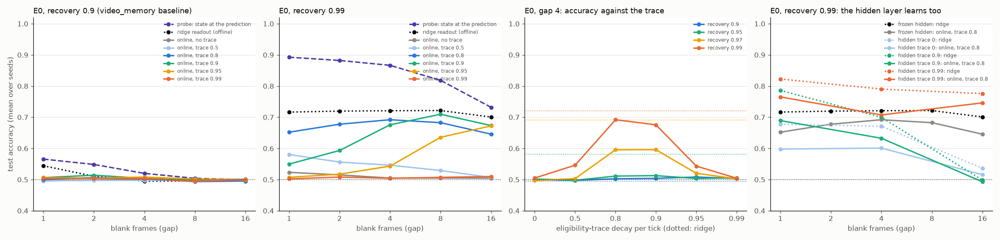

# Learned video memory

Can exRelaxer learn, online, to use a memory trace that its E-R state
already keeps? [video_memory](video_memory.md) (§21) showed that E-R
thresholds keep the direction of an occluded object across up to 16 blank
frames, and that a ridge readout fitted offline can read part of it. Here
the readout learns online, with the library's own error rule, with and
without an eligibility trace, and the state is probed separately. Research
log [§22](research.md#22-learned-video-memory); code and options in
[NNtesting/experiments/video_memory_learned](../NNtesting/experiments/video_memory_learned/README.md);
raw results and every table in
[results/video-memory-learned](../results/video-memory-learned/summary.md).

## Setup

**Unchanged from video_memory.** The side task and its clips (a square
moves left or right, vanishes 1–4 px short of the centre, the screen is
blank for `gap` frames, then it reappears at the centre for 2 frames; the
final frames alone are at chance, audited on 20,000 clips). The hidden
networks and their weights (same seeds): E0 (128 E-R neurons), and the
non-E-R controls C0 (ReLU) and C1 (E-R reset at every frame). The settings:
normalised sum, no habituation, linear threshold growth, recovery 0.9,
resting threshold 0.2, alpha 1.2, learning gain 2.0, clamps 10 (the
library defaults on main, which are the video_memory settings; nothing
from the Doom work changed them). 4 ticks per frame; the decision is the
larger mean readout output over the 8 readout ticks. The ridge readout of
video_memory is recomputed in every trial and matches its published
per-seed accuracy exactly.

**Balanced classes.** Every split of every trial has exactly LEFT 500 /
RIGHT 500 (train), 250 / 250 (validation) and 500 / 500 (test). The trial
checks this and prints it before training (1,405 trials, no exception).
The same clips are used at every gap and for every model and trace, so all
comparisons are paired. A constant predictor scores exactly 0.500.

**Online readout.** Two library readout neurons (weighted sum plus bias)
learn with the delta rule through `Network.apply_error` (the
`feedback_alignment(trace)` rule on an output layer):

```
w_ij += lr · gain · error_j · X_i,     X_i ← d · X_i + x_i  every tick, emptied at the start of each clip
```

Clips come one at a time, in random order, 10 passes. The whole clip runs
through the readouts. The prediction is made as in the test (the mean
output over the readout ticks), and its error (target ±1 minus the
prediction) is applied once, after the last readout tick, to the
eligibility X the rule holds then:

- **A. immediate** (d = 0): the hidden output of the last tick;
- **B. eligibility trace** d = 0.5, 0.8, 0.9, 0.95, 0.99 per tick: a
  decaying sum over the whole clip. At d = 0.8 the readout interval (8
  ticks) dominates; at d = 0.99 most of the eligibility comes from before
  the readout (82% at gap 1, 47% at gap 16 at recovery 0.99).

The forward pass is the same for every d: w · x from the current hidden
output. The trace only decides which inputs the delayed error is credited
to. Each d gets its learning rate from 1e-4 to 3e-2 by validation
accuracy, from the same recordings and the same initial weights.

**Input gain.** The readouts see each hidden output divided by its
standard deviation over the training readout ticks: a fixed gain per
synapse. Without it the delta rule learns nothing (below).

**Probes** (ridge classifiers, network unchanged): on the state before the
reappearance (E-R thresholds and outputs), on the state at the prediction
(thresholds after the readout interval plus the mean outputs), on the
outputs alone (what a linear readout sees), and on each eligibility trace.

## Results



Test accuracy, mean ± sd over 20 seeds (bold: the one-sided 99% lower
bound over seeds is above 0.5). Every table, per seed counts, the
confusion matrices and the training curves are in
[summary.md](../results/video-memory-learned/summary.md).

**The video_memory baseline (E0, recovery 0.9).**

| | gap 1 | gap 2 | gap 4 | gap 8 | gap 16 |
|---|---|---|---|---|---|
| constant | 0.500 | 0.500 | 0.500 | 0.500 | 0.500 |
| probe: state before the reappearance | **0.790 ± 0.021** | **0.790** | **0.790** | **0.790** | **0.790** |
| probe: state at the prediction | **0.566 ± 0.021** | **0.548** | **0.520** | 0.504 | 0.499 |
| ridge readout (offline) | **0.544 ± 0.025** | **0.511 ± 0.016** | 0.495 | 0.496 | 0.495 |
| A. online, immediate | 0.496 ± 0.015 | 0.498 | 0.500 | 0.500 | 0.501 |
| B. online, best trace (0.9) | 0.506 ± 0.019 | **0.514 ± 0.018** | 0.504 | 0.498 | 0.498 |

No online readout learns anything usable here: every trace is within
0.49–0.51 at every gap (the one bold cell is 1 of 30 at p < 0.01). The
per-class accuracies agree (for example LEFT 0.50, RIGHT 0.49 for A at gap
1; confusion summed over seeds 5020 / 4980, 5104 / 4896). C0 and C1 are
at 0.49–0.51 for every readout.

**Slower recovery (E0, recovery 0.99, a separate study).**

| | gap 1 | gap 2 | gap 4 | gap 8 | gap 16 |
|---|---|---|---|---|---|
| probe: state before the reappearance | **0.916 ± 0.013** | **0.916** | **0.916** | **0.916** | **0.916** |
| probe: state at the prediction | **0.893 ± 0.013** | **0.882** | **0.866** | **0.818** | **0.732 ± 0.022** |
| ridge readout (offline) | **0.716 ± 0.024** | **0.720 ± 0.023** | **0.721 ± 0.030** | **0.721 ± 0.023** | **0.701 ± 0.023** |
| A. online, immediate | **0.523 ± 0.030** | 0.515 | 0.505 | 0.505 | 0.505 |
| B. trace 0.5 | **0.581 ± 0.023** | **0.556** | **0.546** | **0.529** | 0.507 |
| B. trace 0.8 | **0.652 ± 0.024** | **0.678 ± 0.026** | **0.692 ± 0.024** | **0.683 ± 0.029** | **0.646 ± 0.031** |
| B. trace 0.9 | **0.550 ± 0.019** | **0.593** | **0.676** | **0.710 ± 0.029** | **0.673 ± 0.023** |
| B. trace 0.95 | 0.507 | **0.517** | **0.543** | **0.636** | **0.672 ± 0.028** |
| B. trace 0.99 | 0.502 | 0.508 | 0.504 | 0.507 | 0.510 |

At 0.99 the online readout does learn: trace 0.8 reaches 0.65–0.69 at
every gap, 0.03–0.06 below ridge (paired, 19–20 of 20 seeds below), with
LEFT and RIGHT accuracy within 0.03 of each other (gap 4: 0.678 and 0.706,
confusion 6781 / 3219, 2941 / 7059). Recovery 0.95 and 0.97 lie in between
(trace 0.8 at 0.97: 0.63, 0.62, 0.60, 0.52, 0.49; ridge 0.73, 0.72, 0.69,
0.61, 0.51).

The trace is not a knob that extends the horizon. Accuracy against d is a
peak, not a rise (third panel), and the best d moves **up** with the gap:
0.8 at gaps 1–4, 0.9 at gap 8, 0.9–0.95 at gap 16. Traces longer than the
readout interval are worst exactly when the blank is short, that is, when
the activity from before the blank is still in the trace.

**Controls.**

- *Immediate learning with an error at every readout tick* (the classic
  online delta rule, 10 seeds): 0.50 at recovery 0.9 and 0.60–0.64 at 0.99
  (horizon 16), below trace 0.8 at every gap.
- *No input gain* (the raw hidden outputs): immediate learning is at 0.50
  at both recoveries, trace 0.8 reaches only 0.52–0.55 at 0.99 (ridge
  0.70–0.72). E-R outputs at the reappearance are sparse and small (mean
  |x| ≈ 0.004), the input covariance has a condition number of about
  25,000, and the bias absorbs the updates.
- *Long traces with learning rates small enough to stay stable* (1e-6 to
  3e-5, 20 seeds, recovery 0.99): trace 0.99 stays at 0.49–0.51 at gaps 1,
  4, 8 and 16 with a bounded error (0.99 was diverging at the default
  grid). Its failure is not instability.
- *Non-E-R hidden layers* (C0 ReLU, C1 reset every frame): every probe of
  the state and every readout at chance, at every gap.

## Diagnostics

**Memory: what the state holds.** At recovery 0.9, 27 of 128 hidden
neurons are direction-selective while the object is visible (|d′| > 0.5),
and fewer than one threshold is selective by itself before the
reappearance, yet a probe on all thresholds reads 0.79 at every gap: the
memory is distributed. At the prediction it is mostly gone (0.57 at gap 1,
0.50 from gap 8): the reappearance burst resets the thresholds (§21). At
recovery 0.99, 11 neurons are selective while visible, 7 thresholds stay
selective, the state before the reappearance reads 0.92 and the state at
the prediction still reads 0.73–0.89. No single output at the prediction
is selective (0 of 128 at both recoveries): the direction is in the
pattern, not in any neuron.

**The eligibility trace is itself a memory.** A probe on the trace at
the moment of the error reads the direction far better than the network's
own state: 0.96–0.97 at recovery 0.9 for d = 0.99 at every gap, 0.99 for C0,
which has no state at all. The trace is a leaky integrator of the whole
clip. But it only steers learning: the readout never sees it in its
forward pass.

**Credit assignment** (training clips, recovery 0.99; Δw = change of
w_RIGHT − w_LEFT per hidden neuron, correlated with that neuron's
direction selectivity):

| | Δw vs selectivity before the blank | Δw vs selectivity in the outputs at the prediction | Δw vs ridge weights | eligibility from before the readout |
|---|---|---|---|---|
| immediate, gap 4 | −0.01 | +0.09 | +0.08 | 0 |
| trace 0.8, gap 4 | −0.06 | **+0.76** | **+0.83** | 0.01 |
| trace 0.9, gap 1 | **+0.54** | +0.21 | +0.19 | 0.52 |
| trace 0.9, gap 8 | −0.02 | **+0.80** | **+0.90** | 0.03 |
| trace 0.99, gap 4 | **+0.47** | +0.05 | +0.03 | 0.75 |
| trace 0.99, gap 16 | **+0.64** | +0.09 | +0.09 | 0.47 |

(Δw vs the neurons' threshold selectivity before the reappearance is
−0.05 to +0.02 everywhere.)

The trace does exactly what it was designed to: the delayed error reaches
the neurons that encoded the direction before the blank, and their
weights change in the direction they encoded (correlation +0.5 to +0.7).
Those are the wrong synapses. At the prediction these neurons do not
carry the direction in their output, so the change does not help, and it
competes with the useful change (the one ridge makes, on the outputs at
the prediction). Learning works when the eligibility is the activity the
prediction was made from (trace 0.8, or 0.9–0.95 once the blank is long
enough to empty the trace); then Δw matches ridge's weights (+0.8 to
+0.9).

The link in the requested causal chain that breaks is the last one:

```
early visual input -> direction-selective neurons (yes: 11-27 of 128)
  -> persistent E-R state (yes: probe 0.79-0.92 at every gap)
  -> eligibility trace (yes: it reads 0.9-0.99, and it credits those neurons)
  -> delayed prediction error -> weight update (yes, on those neurons' readout synapses)
  -> correct LEFT/RIGHT prediction (no: those synapses do not carry the direction at the prediction)
```

## Condition D: the hidden layer learns too

`mode=hidden` (10 seeds, gaps 1, 4, 16): the hidden layer learns by
feedback alignment from the same end-of-clip error, with its own trace over
the pixels, from the frozen network's weights; then it is frozen and read
out as above. Recovery 0.99, learning rate 0.003:

| hidden trace | probe: state before the reappearance | probe: state at the prediction | ridge readout | online readout, trace 0.8 |
|---|---|---|---|---|
| frozen (reference) | 0.92, 0.92, 0.92 | 0.89, 0.87, 0.73 | 0.72, 0.72, 0.70 | 0.65, 0.69, 0.65 |
| 0 | 0.92, 0.92, 0.88 | 0.79, 0.77, 0.66 | 0.68, 0.67, 0.54 | 0.60, 0.60, 0.52 |
| 0.9 | 1.00, 0.99, 0.84 | 0.99, 0.95, 0.60 | 0.79, 0.70, 0.50 | 0.69, 0.63, 0.49 |
| 0.99 | **0.99, 0.99, 1.00** | **0.98, 0.97, 0.90** | **0.82, 0.79, 0.78** | **0.77, 0.71, 0.75** |

(gaps 1, 4, 16; sd over seeds 0.003–0.06.) This is the one place where
the eligibility trace helps, and it helps a lot: with a hidden trace of
0.99, the delayed error changes the input weights of the neurons that saw
the object before the blank, so they respond to the direction more, and
the E-R thresholds they leave behind encode it almost perfectly (probe
0.99 at every gap) and keep it through the reappearance (0.90 at gap 16).
The online readout then reaches 0.71–0.77 at every gap, at or above the
frozen network's best trace at each gap (0.65, 0.69, 0.67), with LEFT and RIGHT balanced (gap 16: 0.74
and 0.75). Without a trace (hidden trace 0) the error reaches only the
readout-tick input, and the hidden learning hurts. At recovery 0.9 the
hidden trace 0.99 lifts the state too (ridge 0.71, 0.68, 0.70 against
0.54, 0.50, 0.50 frozen) but the online readout follows only at gap 4
(0.61). With C0 (no state) the same training cannot help: nothing survives
the blank (every probe and readout at 0.49–0.51; C1 alike).

## Answers

**Can exRelaxer learn to use a memory trace it already maintains?** Only
partly, and not by the route the trace was meant to open.

- **Memory** is not the limit at the default recovery: the state keeps the
  direction (0.79) at every gap. It is the limit at the prediction: the
  reappearance erases most of it (0.57 → 0.50), which caps every readout,
  offline or online. With a slower recovery (0.99) the state at the
  prediction keeps 0.73–0.89.
- **Readout** is the first limit for online learning: the delta rule on
  raw E-R outputs learns nothing (conditioning), and even with a
  per-synapse gain it learns only where the offline readout is well above
  chance: 0.65–0.69 at recovery 0.99 (ridge 0.70–0.72), 0.52–0.63 at 0.97.
  At recovery 0.9 the signal ridge finds (0.54) is too weak for it.
- **Temporal credit assignment on the readout** makes things worse, not
  better: an eligibility trace longer than the readout interval credits the
  neurons that were active before the blank, which is correct as credit
  and useless as a readout change, because the readout only sees their
  current output. The best trace is the one that matches the readout
  interval, and the horizon comes from the memory (recovery), not from the
  trace.
- **Credit assignment into the network works.** When the delayed error
  reaches the hidden layer through a long trace, it reshapes what the E-R
  state stores, the state then holds the answer at the prediction, and the
  online readout uses it at every gap (0.71–0.77 at recovery 0.99, the best
  learned result here). This is case D: learning modifies the network so
  that the information becomes usable.

So the primary limitation is **readout of the state at the moment of
prediction** (memory erased by the reappearance at the default recovery,
and a readout rule that is sensitive to input scale), not temporal credit
assignment as such. Eligibility traces are the right tool one layer
earlier: on the hidden layer, where the delayed error can change what the
memory holds, not on the readout.
